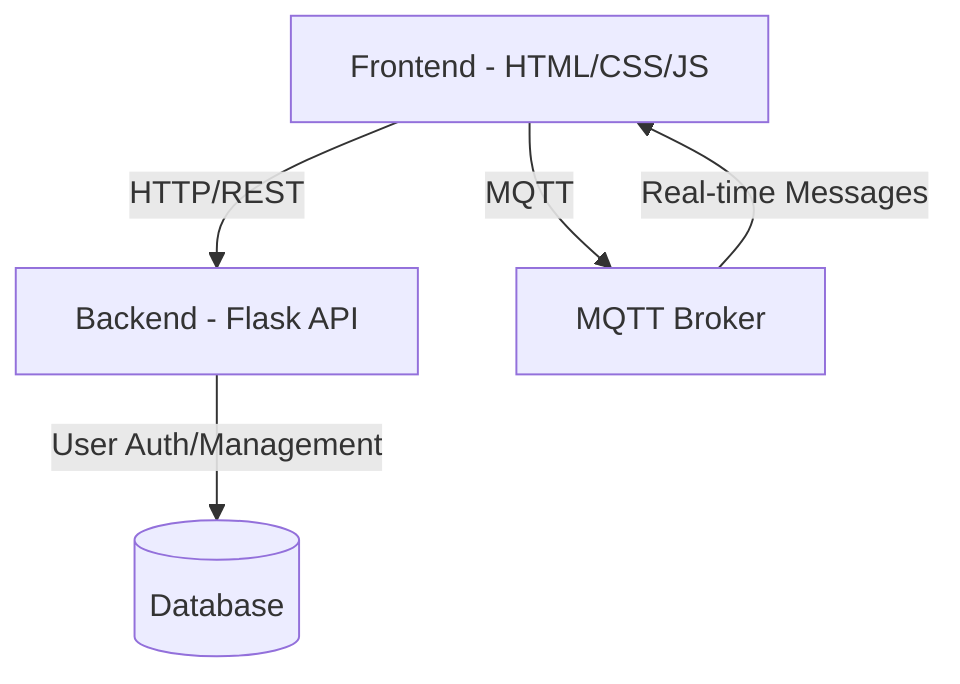
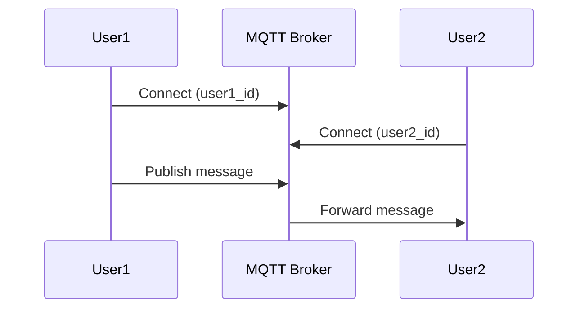

# Social App Architecture Plan

## Overview
This document outlines the architecture for a social app with real-time messaging capabilities using HTML/CSS/JavaScript for the frontend, Flask for the backend API, and MQTT for real-time communication.

## System Architecture



## Key Components

### 1. Frontend
- Single page application using vanilla HTML/CSS/JavaScript
- Components:
  - Login/Registration page
  - Main chat interface
  - User connection page (using IDs)
- Features:
  - User authentication
  - Real-time message display
  - User ID management
  - Connection status indicators

### 2. Backend (Flask API)
- RESTful API endpoints:
  ```
  POST /api/auth/register - Register new user
  POST /api/auth/login - User login
  GET /api/users/:id - Get user by ID
  POST /api/messages - Store messages
  GET /api/messages/:userId - Get message history
  ```
- JWT-based authentication
- SQLite database for storing:
  - User information
  - Message history

### 3. MQTT Integration


- MQTT Topics structure:
  - `chat/{user_id}` - Personal channel for each user
  - `status/{user_id}` - Online/offline status

## Project Structure
```
social-app/
├── frontend/
│   ├── index.html
│   ├── style.css
│   ├── js/
│   │   ├── main.js
│   │   ├── auth.js
│   │   └── mqtt-client.js
├── backend/
│   ├── app.py
│   ├── config.py
│   ├── models.py
│   └── requirements.txt
└── README.md
```

## Implementation Steps

1. **Setup Phase**
   - Initialize project structure
   - Set up Flask backend
   - Create database models
   - Set up MQTT broker connection

2. **Backend Development**
   - Implement user authentication
   - Create API endpoints
   - Set up database connections
   - Configure MQTT integration

3. **Frontend Development**
   - Create login/registration UI
   - Implement chat interface
   - Set up MQTT client
   - Add real-time message handling

4. **Integration**
   - Connect frontend with Flask API
   - Implement MQTT message subscription
   - Test real-time communication

## Technical Specifications

### Database Schema
```sql
CREATE TABLE users (
    id INTEGER PRIMARY KEY,
    username TEXT UNIQUE NOT NULL,
    password_hash TEXT NOT NULL,
    created_at TIMESTAMP DEFAULT CURRENT_TIMESTAMP
);

CREATE TABLE messages (
    id INTEGER PRIMARY KEY,
    sender_id INTEGER NOT NULL,
    receiver_id INTEGER NOT NULL,
    content TEXT NOT NULL,
    timestamp TIMESTAMP DEFAULT CURRENT_TIMESTAMP,
    FOREIGN KEY (sender_id) REFERENCES users (id),
    FOREIGN KEY (receiver_id) REFERENCES users (id)
);
```

### API Response Formats
```json
// User Registration Response
{
    "success": true,
    "user_id": "12345",
    "token": "jwt_token_here"
}

// Message Format
{
    "id": "msg_123",
    "sender_id": "12345",
    "receiver_id": "67890",
    "content": "Hello!",
    "timestamp": "2024-03-20T11:30:00Z"
}
```

## Security Considerations
- JWT-based authentication
- Password hashing using bcrypt
- MQTT connection security
- Input validation and sanitization
- Rate limiting on API endpoints

## Dependencies
- Frontend:
  - MQTT.js client library
  - Custom CSS for styling
- Backend:
  - Flask
  - Flask-SQLAlchemy
  - Flask-JWT-Extended
  - paho-mqtt
  - bcrypt

## Testing Strategy
1. Unit tests for API endpoints
2. Integration tests for MQTT communication
3. End-to-end testing for chat functionality
4. Load testing for concurrent connections